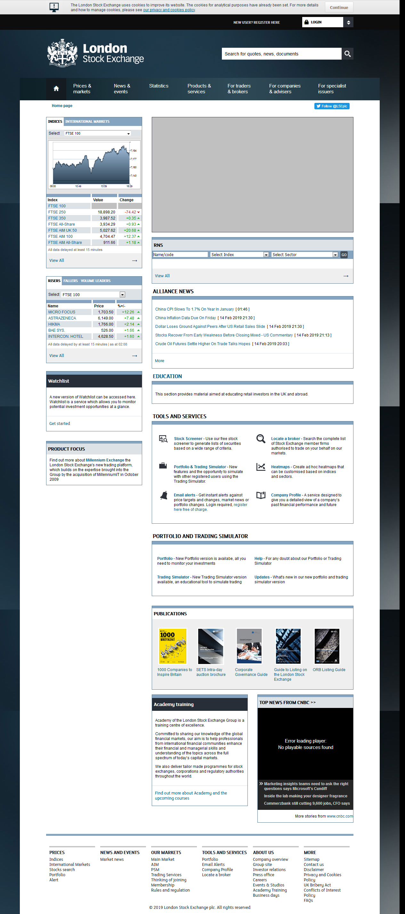
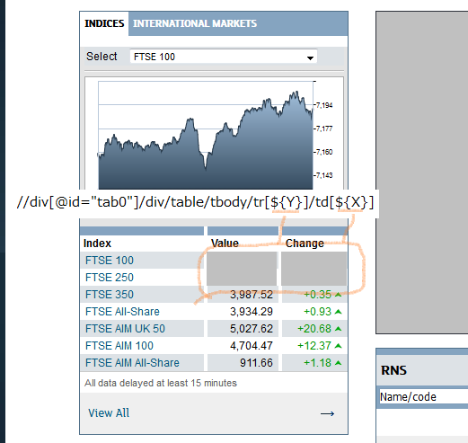

# Entire page screenshot example and Request for ObjectRepository improvment

This is a small [Katalon Studio](https://www.katalon.com/) project for demonstration purpose. This project was developed using Katalon Studio version 5.10.1.

## Wht is this

In this project I will report a small problem in the   [com.kms.katalon.core.testobject.ObjectRepository](https://github.com/katalon-studio/katalon-studio-testing-framework/blob/master/Include/scripts/groovy/com/kms/katalon/core/testobject/ObjectRepository.java) class. I will describe the problem, and will show you how I worked around it. And I will propose an idea of improvement for the class.

## Taking entire screen shot of a web page - an example

Before talking about problems, I will give you a successful demo of taking screenshot of a web page. You can try the demo.

### How to see the demo

1. Download the zip of this project from [Releases](https://github.com/kazurayam/Entire_page_screenshot_example_and_request_for_ObjectRepository_improvement/releases) page. Unzip it. Open it with your local Katalon Studio.
2. Open the test suite `Test Suites/Execute`
3. Run the test suite with any browser you like.
4. The test script will open browser, navigate to [London Stock Exchange: Homepage](https://www.londonstockexchange.com/home/homepage.htm). It will take screen shot and save into `<project dir>/Materials` directory.
5. Open a file `<project dir>/Materials/index.html` with your browser. Guided through the index, you will find a PNG file like this:


### Features implemented

This demo has a few notable points.

1. This demo uses [aShot](https://github.com/pazone/ashot), WebDriver Screenshot utility to take screen shots of web pages.
2. This demo takes entire/full page screen shot.
3. This demo makes a directory `<project dir>/Materials`. The PNG image file is located at the path of
```
<project dir>/Materials/<Test Suite Name>/<Test Suite Timestamp>/<Test Case Name>/<file name>
```
4. Output path is resolved semi-automatically with help by [`Materials`](https://github.com/kazurayam/Materials) library. This path structure is convenient if you are to run the test (e.g, taking screenshots) repeatedly. The artifact files are stored in the individual directories.
5. The screenshot has grey-colored rectangles over specified web elements in the target page. This rectangles are useful for intentionally ignoring particular portions when 2 images are compared.
6. This demo shows how to deal with floating banner, or called [Sticky Header on Scroll](https://www.w3schools.com/howto/howto_js_sticky_header.asp). Floating banner is usually a `<div>` with style `position:fixed`. If you do not treat floating banner specially, the banner is repeated in the entire page image which looks unprofessional. This demo shows how to make the banner not to float.

## Request to improve com.kms.katalon.core.testobject.ObjectRepository class

### Problem

Please open [Test Cases/problems/case2_parameterizedTO_reproduced](Scripts/problems/case2_parameterizedTO_reproduced/Script1550193830805.groovy) and execute it. This script tries to take screenshot of [London Stock Exchange: Homepage](https://www.londonstockexchange.com/home/homepage.htm), but will fails. In the Console, you will see the following error message:

```
2019-02-15 14:08:33.639 ERROR k.k.c.m.CustomKeywordDelegatingMetaClass -
    X Given xpath expression
    "//div[@id="tab0"]/div/table/tbody/tr[${Y}]/td[${X}]"
    is invalid: SyntaxError: The expression is not a legal expression.
```

The error is occuring at the following line :
```
addIgnoredElement(findTestObject('Page_LSE_home/tab0_trY_tdX',
                                 ['Y':1, 'X':3])).

```

In [Test Cases/problems/case2_parameterizedTO_reproduced](Scripts/problems/case2_parameterizedTO_reproduced/Script1550193830805.groovy) has following code:
```
Options options = new ScreenshotDriver.Options.Builder().
        addIgnoredElement(findTestObject('Page_LSE_home/tab0_trY_tdX', ['Y':1, 'X':3])).
```

Please remark that here I use the technique of ["Parametarize Test Object Properties"](https://docs.katalon.com/katalon-studio/docs/parameterize-webmobile-test-object-properties.html). `ScreenshotDriver`, `Options`, `Builder` --- these classes are my own custom Groovy classes. My class is throwing a error.

Why it fails?

### My study

[Test Cases/problems/case2_parameterizedTO_reproduced](Scripts/problems/case2_parameterizedTO_reproduced/Script1550193830805.groovy) has another portion of code:
```
// let's see what is retured by the ObjectRepository#findTestObject() call
println "findTestObject('Page_LSE_home/tab0_trY_trx',['Y':1,'X':3]'):\n" +
	JsonOutput.prettyPrint(JsonOutput.toJson(
		findTestObject('Page_LSE_home/tab0_trY_tdX', ['Y':1, 'X':3])
	)
)
```

When executed, this code emits the following output:
```
findTestObject('Page_LSE_home/tab0_trY_trx',['Y':1,'X':3]'):
{
    "objectId": "Object Repository/Page_LSE_home/tab0_trY_tdX",
    "parentObjectShadowRoot": false,
    "properties": [
        {
            "active": true,
            "value": "//div[@id=\"tab0\"]/div/table/tbody/tr[1]/td[3]",
            "condition": "EQUALS",
            "name": "xpath"
        },
        {
            "active": false,
            "value": "foo",
            "condition": "EQUALS",
            "name": "name"
        },
        {
            "active": true,
            "value": "td",
            "condition": "EQUALS",
            "name": "tag"
        }
    ],
    "imagePath": null,
    "selectorMethod": "BASIC",
    "selectorCollection": {
        "BASIC": "//div[@id=\"tab0\"]/div/table/tbody/tr[${Y}]/td[${X}]"
    },
    "useRelativeImagePath": false,
    "parentObject": null,
    "xpaths": [

    ],
    "activeProperties": [
        {
            "active": true,
            "value": "//div[@id=\"tab0\"]/div/table/tbody/tr[1]/td[3]",
            "condition": "EQUALS",
            "name": "xpath"
        },
        {
            "active": true,
            "value": "td",
            "condition": "EQUALS",
            "name": "tag"
        }
    ],
    "activeXpaths": [

    ]
}
```

The following portion is significant for me.
```
"selectorCollection": {
    "BASIC": "//div[@id=\"tab0\"]/div/table/tbody/tr[${Y}]/td[${X}]"
},
```
In the Value of SelectorCollection, I expected the placeholders (`${Y}`, `${X}`) to be interpolated to row number `1` and column number `3`. But this does not take place.

My custom code ([TestObjectSupport](Keywords/com/kazurayam/ksbackyard/TestObjectSupport.groovy) class toBy() method) refers to the SelectorCollection of TestObject class. It expects a valid XPath expression is returned. It turns the XPath to an instance of Selenium `By` object.

Unfortunately the current TestObject returned by ObjectRepository#findTestObject() contains a Selector with placeholders (`${Y}`, `${X}`) retained. This causes the above mentioned error.

### Wondered ...

In the pretty-printed string of TestObject instance, you can find well-processed XPath expressions (`//div[@id=\"tab0\"]/div/table/tbody/tr[1]/td[3]`) in other properties. Only the Selector Colletion retains the placeholder string (`${Y}`, `${X}`). Whey? Is there any reason?

I wondered for a few days. And now I suppose, there is no specific reason. Possibly the Selector Collection in a TestObject object is NOT used by the Katalon Studio itself. It is not an important property. Therefore the Katalon programmer did not care about it.

### My workaround

I have made a test case to demonstrate how to fix this problem.

Please open [Test Cases/problems/case2_parameterizedTO_improvement](Scripts/problems/case2_parameterizedTO_improvment/Script1550193820302.groovy) and execute it. It should run successfully. It creates a screenshot where Stock Index FT-100 and FT-250 are painted with grey rectangles.


In the execution log, you will find the TestObject has Selector Collection value where placeholders are interpolated with integer values.
```
"selectorCollection": {
    "BASIC": "//div[@id=\"tab0\"]/div/table/tbody/tr[1]/td[3]"
},
```

In the [Test Cases/problems/case2_parameterizedTO_improvement](Scripts/problems/case2_parameterizedTO_improvment/Script1550193820302.groovy) code, I employed Groovy's [MetaProgramming](http://groovy-lang.org/metaprogramming.html#metaprogramming_emc) feature.


## Conclusion

Let me repeat it. The current TestObject's getSelectorCollection() method returns XPath string with placeholders retained, like this:
```
"selectorCollection": {
    "BASIC": "//div[@id=\"tab0\"]/div/table/tbody/tr[${Y}]/td[${X}]"
},

```

I want TestObject's getSelectorCollection() to return XPath string with placeholders are interpolated with values, like this:
```
"selectorCollection": {
    "BASIC": "//div[@id=\"tab0\"]/div/table/tbody/tr[1]/td[3]"
},
```

In order to accomplish this, [com.kms.katalon.core.testobject.ObjectRepository](https://github.com/katalon-studio/katalon-studio-testing-framework/blob/master/Include/scripts/groovy/com/kms/katalon/core/testobject/ObjectRepository.java) needs to be slightly modified.
